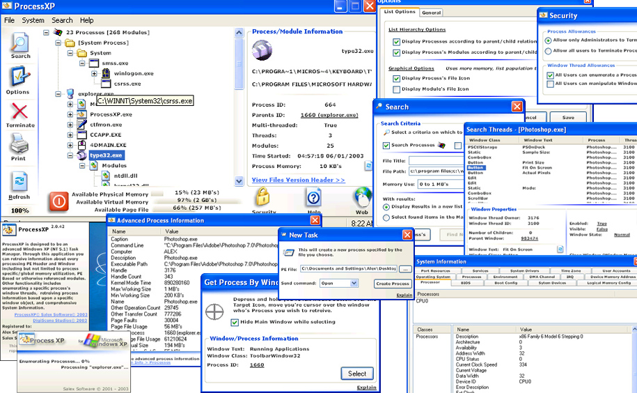



## ProcessXP

### Description

ProcessXP &#8211; Advanced Windows NT Process Viewer. Through this application you can retrieve information on every processing PE Header File and window including but not limited to process specific/global memory utilization, PE Based or otherwise referenced (loaded) modules. Other functionality includes enumerating a specific processes window threads, retrieving process information based upon a specific window object and comprehensive system information including Port Resources, Services, System Devices {Disk partitions, Media Drives, Disk Drives, Floppy Controllers, IDE Controllers, Keyboards, Mother Board Devices, Network Adapters, Plug-n-play entities, POTS Modems, Printers, Sound Devices, Logical Disks, Parallel Ports, Serial Ports, USB Controllers, USB Hubs, Desktop Monitors, Video Controllers}, System Drivers, Time Zone Info, NT User Accounts, Processors, Basic Input Out System, Boot Configs, Logical Memory Configs, Operating Systems, Processes(Advanced), Environmental Variables, DMA Channels, IRQ Resources, Device Memory Addresses.

ProcessXP and its accompanying System Information application use a CPP compiled GUI Standard Dynamic Link Library explicitly developed for ProcessXP and its components for drawing Vertical, Horizontal, Semi-radial horizontal gradients using predefined system colors, source code and compiled module also included. These three projects (ProcessXP (VB), System Information (VB), and GUI Dll(C++) consist of 9,964(excluding comments) lines of code including (vb) external function declarations(Resource files included(Icons/bitmaps) with the exclusion of the wav files as they are compiled in a .res file).Also included in this project: ProcessXP external sound server( Active-X Dynamic Link Library).This component is used for playing &#8216;explanation&#8217; sounds on request by its client (ProcessXP), the wave file resources are stored in the DLL its self as resources, when the sound class initializes it loads these files as resources, retrieves the systems temp folder, and saves these file, on request it plays them using API function: sndPlaySound. On this sound classes termination it purges these files from the system. This method of distributing somewhat large wav files is for speed, also using options a client can disable ProcessXP from using the sound server, and so if the client wishes to do so then they are paying for what they don&#8217;t want by the speed of ProcessXP un-necessarily decreasing.Minimum Operating System required is Windows 2000(NT 5.0), although this application and its components were explicitly developed for Windows XP(NT 5.1). Attempting to execute this application or its components on an earlier version of NT or Win32&#8217;s or Win32 Windows will result in an incompatible operating system dialog.Files available on request: InstallShield Professional 7 skinned project files for ProcessXP and its components.This development of this application and its components consumed approx. Two and a half weeks of time.This is an advanced Open Source Code project.I hope this project is useful to you, thanks. Alex Smoljanovic. Instructions: See Intructions.txt...
 
### More Info
 

             |
---                |---
**Submitted On**   |2003-01-14 20:00:28
**By**             |[Alex Smoljanovic\(aLeX^rS\)](https://github.com/Planet-Source-Code/PSCIndex/blob/master/ByAuthor/alex-smoljanovic-alex-rs.md)
**Level**          |Advanced
**User Rating**    |4.9 (302 globes from 62 users)
**Compatibility**  |VB 5\.0, VB 6\.0
**Category**       |[Complete Applications](https://github.com/Planet-Source-Code/PSCIndex/blob/master/ByCategory/complete-applications__1-27.md)
**World**          |[Visual Basic](https://github.com/Planet-Source-Code/PSCIndex/blob/master/ByWorld/visual-basic.md)
**Archive File**   |[ProcessXP1529311142003\.zip](https://github.com/Planet-Source-Code/alex-smoljanovic-alex-rs-processxp__1-42355/archive/master.zip)

